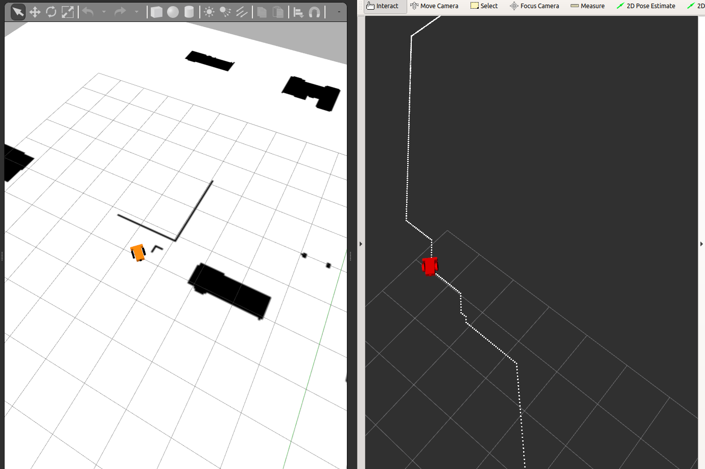

# Assignment 1 - Path Planning Assignment 

## Questions 1 and 2

**Please see assignment instructions under MyCourses.** 

## Question 3 Draft (REMOVED)

### Gazebo Path Visualization 
- To visualize your path in the Gazebo simulator, launch the `gazebo_plan_visualization` script: 


__Launch Gazebo World__
```shell script
roslaunch path_planning_and_control_assignment world.launch
```

__Launch visualization node__
```shell script
roslaunch path_planning_and_control_assignment follow_waypoints.launch
```

__Run Astar Planner__
```shell script
python astar_planner.py $(rospack find path_planning_and_control_assignment)/worlds/map.pkl
```
__OR Run stub publisher node code (ouputs square path)__
```shell script
python publish_waypoints.py 
```

### Example Output




### Parameters

| Parameter | Description | Default Value | 
|------------|-----------|-------------|
map_file | Map file to use | $(rospack find path_planning_and_control_assignment)/materials/map.png | 
end_on_collision | When set, the gazebo agent will terminate movement when it detects a collision. | False |
throttle | Throttle to apply when following waypoints  | 0.6 |
update_hz | Main control update loop | 60 |
pid_p | Proportional gain on steering error for PID control when moving to waypoints | 3 | 
waypoint_dist_threshold | Distance to waypoint before it is concidered satisfied | 0.1 | 
stop_to_turn_threshold | Threshold on current and target angle error when moving towards a waypoint that vehicle will stop throttle and focus solely on turning to align itself with the waypoint | 0.3491 | 
bbox_x | X direction bounding box of car (mirrored in -x direction) | 0.205 | 
bbox_y | Y direction bounding box of car (mirrored in -y direction) | 0.165 | 


