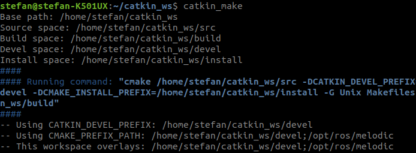
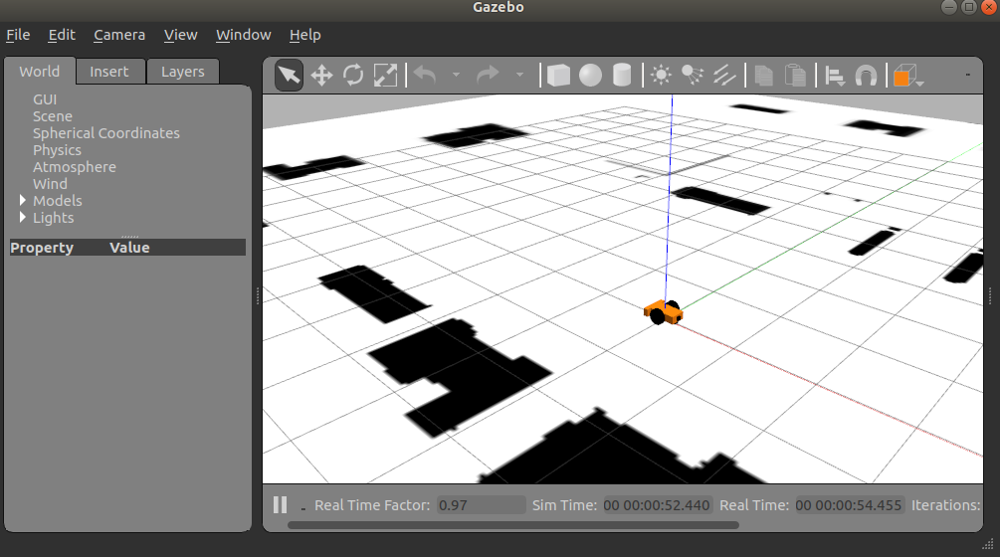
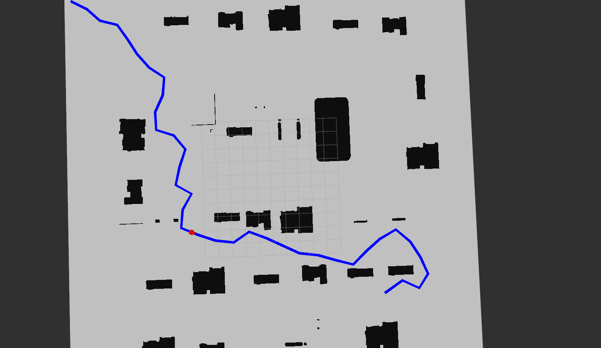
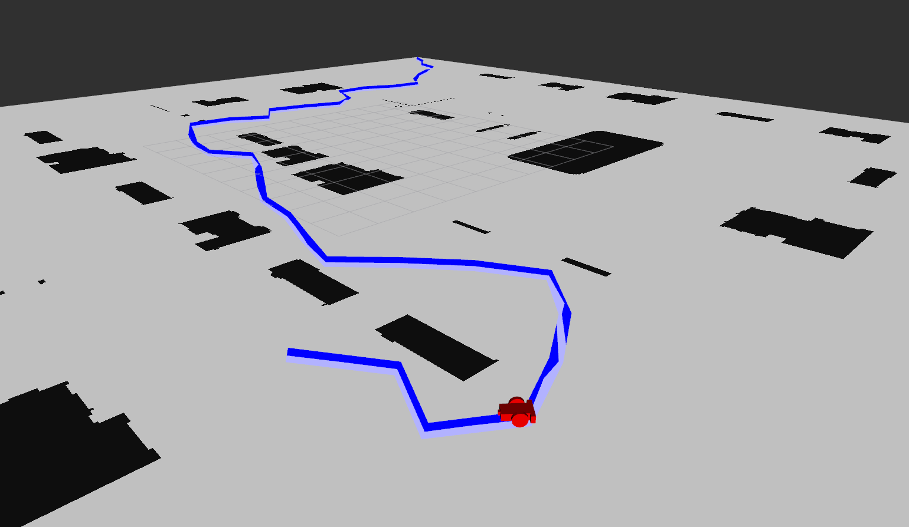
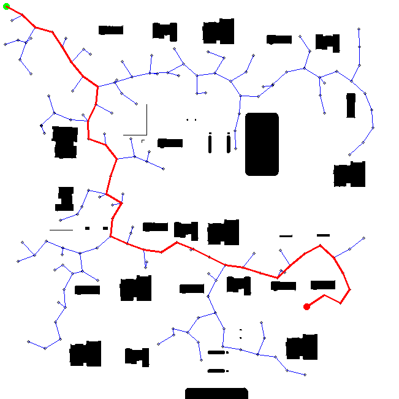

# COMP 417 Assignment 1 - Question 3 

For the final step in this assignment, we have coded a Robot Operating System (ROS) simulation
of a robot in the very same environment you’ve been planning in for Q1 and Q2. You will be publishing your planned path to a ROS node which will execute the path in the simulated world.

## ROS Requirements
- To complete this question, you will need a version of ROS installed on your system (ROS Melodic and Kinetic have been tested). 
- You can find general installation instructions for ROS [here](http://wiki.ros.org/ROS/Installation).
- ROS Melodic has already been installed on the Trottier 3120 computers
    - [A tutorial on getting started with ROS on the Trottier computers (See the README.md)](https://github.com/comp417-fall2019-tutorials/ros_tutorial).  
- **Please make sure that you have configured your ROS workspace before attempting this question.**

## Building the ROS Project 
- To run question 3 with ROS, this repository will need to be installed as a ROS package.
- The assign1_comp417 project should be placed in your ROS ``catkin_ws/src`` folder. Example: ``/home/<username>/catkin_ws/src/assign1_comp417``.
- Build the project with catkin_make: 

```shell script
cd ~/catkin_ws 
catkin_make 
```

__Sample Output__  


- Finally, confirm that the package exists: 
```shell script
rospack list | grep assign1_comp417
```
__Sample Output__  


## Launching the Simulator
- To launch the Gazebo simulator and required ROS nodes, use the following ``roslaunch`` command: 

```shell script
roslaunch assign1_comp417 question3.launch
```

You should see the following Gazebo world: 




In addition, an RVIZ (ROS Visualization) window should appear:


## Tasks to Complete 
1. Modify your ``rrt_planner.py`` so that when it completes, it calls the ``publish_waypoints`` function in the ``publish_waypoints.py`` file.
2. Update the ``publish_waypoints`` function in ``publish_waypoints.py`` to convert your list of states in the plan array to a list of waypoints stored in a ROS ``PointCloud`` message.
 
We have provided a simple example of publishing a single waypoint when ``publish_waypoints.py`` is launched as the main file as a reference.


## Deliverables 
- Take a screenshot in RVIZ (__File > Save Image__) of the robot following one of your RRT path.
- Be sure to take an overhead image with a view of most of the path.
- Please name the file **ros_rviz_result[0|1|2]_yourname.png** and ensure that the result number [0|1|2] in the file matches with the png result you submitted for Question 2.

__Sample Result From Overview View__  


__Sample Result From Level View__  


__Original RRT Map__  



